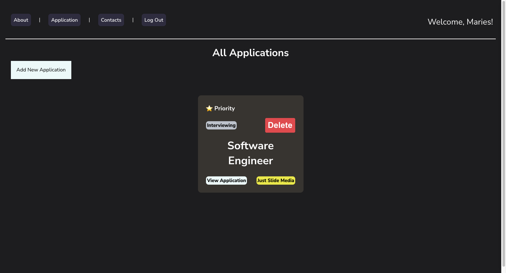
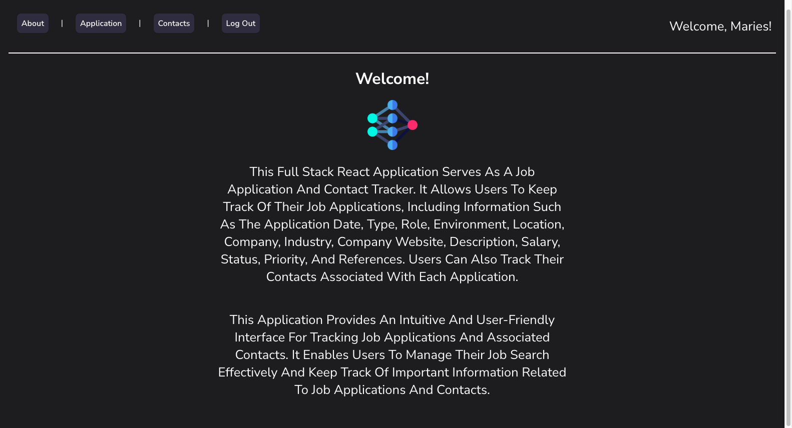
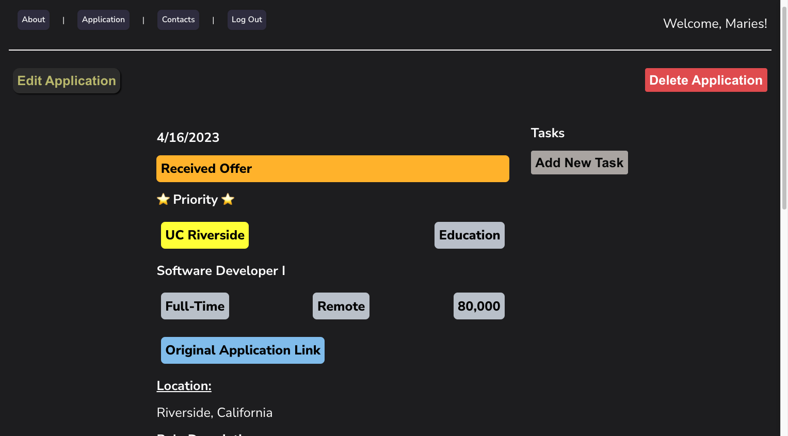

# Connect Bridge
#### Track your job applications and organize your network
___
This is a full-stack application built with React, Express, and MongoDB that allows users to track job applications and manage contacts. The application allows users to add, edit, and delete jobs, as well as track the status of each application. In addition, users can also add, edit, and delete contacts and associate them with specific jobs.

### Application Features
___

- Focus on more meaningful network-based job applications

##### Track Job Application
- Track Job Application with full CRUD implementation
- Add tasks for each application in View Application page

##### Save Contacts
-  Create, read, update, and delete contacts
- Associate Job Applications with contacts
- Enable ```Star Contacts``` option for favorite contacts
- Allows users the option to upload profile pictures to enable easier recognition of contacts

##### Tasks for Application
- Quickly update, delete, and create new tasks within an application.

### Screenshot
___





### Technologies Used
___
- JavaScript
- HTML
- CSS
- NodeJS
- Express
- MongoDB, Mongoose
- React

### Getting Started
___

<a href="https://trello.com/b/dbFgNmVC/job-app-tracker">Project Planning</a>
<br>
<a href="https://connect-bridge.herokuapp.com/">Deployed App</a>

### Next Steps
___
- Allow users to search and filter jobs by various criteria such as company, job title, and application status.
- Implement email reminders for application deadlines and follow-up actions.
- Add data visualization features to help users track their job application progress in a dashboard.
- Allow users to upload resumes and cover letters and associate them with specific job applications.
- Have a calendar feature to quickly show upcoming events or interviews


#### Key Learning and Takeaways
___

##### React Hooks
  - React Hooks are a powerful tool for managing state and side effects in functional components

##### Reusable Components
  - Creating reusable components is important for keeping the codebase organized and maintainable. I was able to easily debug and update my code. Plus, I see the benefit of reusing components across different parts of the application, which can save a lot of time and effort in the long run for future projects.

- State management was extremely helpful. ```useState``` was used to manage component-level state, and ```useEffect``` handled side effects like fetching data from the backend.